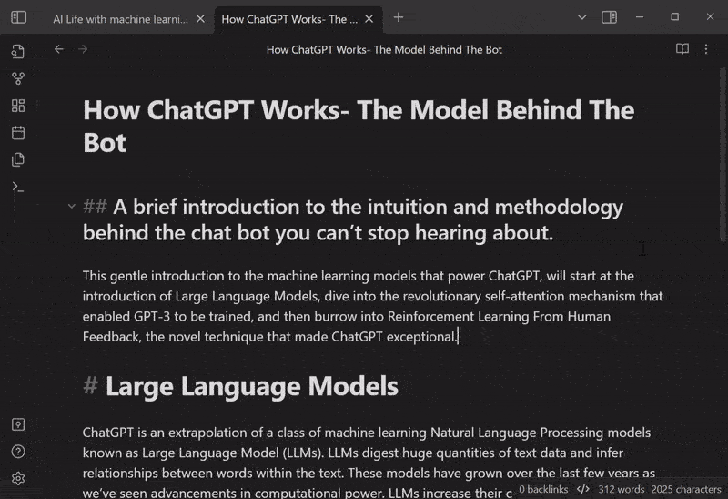
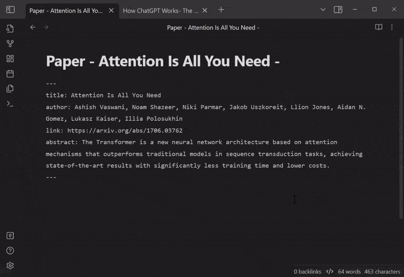
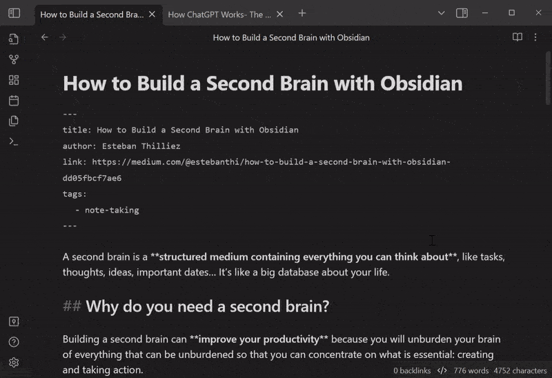

# Auto Classifier

 

`Auto Classifier` is an [Obsidian](https://obsidian.md/) plugin that helps you automatically classify tags in your notes using any OpenAI-compatible LLM API. The plugin can analyze your note (including its title, frontmatter, content, or selected area) and suggest relevant tags based on the input with tags in your vault. This can be used for various specific purposes, for example, DDC classification for books, keyword recommendation, research paper categorization, and so on. Save time and improve your note organization.

## How to use

-   Configure your API settings in the settings tab:

    -   Enter your API key
    -   Optionally set a custom base URL (useful for proxies or alternative API
        endpoints)
    -   Choose your preferred model
    -   Test your configuration using the Test API call button

-   This plugin consists of **4 Input Commands** that you can run. By simply running these commands, it will automatically classify your note:

    -   `Classify tag from Note title`
    -   `Classify tag from Note FrontMatter`
    -   `Classify tag from Note Content`
    -   `Classify tag from Selected Area`

-   Toggle and choose from different **Tag Reference** types. The LLM will select the appropriate tag from these references:

    -   `All tags` (default)
    -   `Filtered Tags` with regular expression
    -   `Manual Tags` that are defined manually

-   Specify the **Output Type** from the response of the LLM:

    -   `#Tag`: at your `Current Cursor` or `Top of Content`
    -   `[[WikiLink]]`: at your `Current Cursor` or `Top of Content`
    -   `FrontMatter`: with `key`
    -   `Title Alternative`: at the end of note's title

-   (Optional) Add a `Prefix` or `Suffix` for the output format.

-   (Optional) You can use your custom request for your selected API:
    -   `Custom Prompt Template`
        -   The LLM will respond based on this prompt. The input coming from your Command will be replaced by `{{input}}`, and the reference tags you set will be placed in `{{reference}}`.
    -   `Custom Chat Role`
        -   You can guide the AI's behavior by setting this system role

## Example

### Use Case #1: **Selected area** &rightarrow; **Current cursor**


### Use Case #2: **Content** &rightarrow; **FrontMatter**



### Use Case #3: **FrontMatter** &rightarrow; **Title**



### Use Case #4: **Title** &rightarrow; **FrontMatter**



### DDC number classification

If you want to use this plugin for DDC number classification, edit the `Custom Prompt Template` like this:

```
Please use Dewey Decimal Classification (DDC) to classify this content:
"""
{{input}}
"""
Answer format is JSON {reliability:0~1, output:"[ddc_number]:category"}.
Even if you are not sure, qualify the reliability and select one.
Convert the blank spaces to "_" in the output.
```

### LCSH classification

LCSH classification can be similar:

```
Please use Library of Congress Subject Headings (LCSH) to classify this content:
"""
{{input}}
"""
Answer format is JSON {reliability:0~1, output:"[First LCSH term]--[Second LCSH term]--[Third LCSH term]"}.
Even if you are not sure, qualify the reliability and select one.
Convert the blank spaces to "_" in the output.
```

## Installation

-   Search for `Auto Classifier` in the Community plugin tab of the Obsidian settings.
-   Alternatively, you can manually download the latest release from this repository's [GitHub releases](https://github.com/hyeonseonam/auto-tagger/releases) and extract the ZIP file to your Obsidian plugins folder.

## Support

If you encounter any issues while using this plugin or have suggestions for improvement, please feel free to submit an issue on the GitHub repository. Pull requests are also welcome.

## Author

Hyeonseo Nam

## License

MIT License
